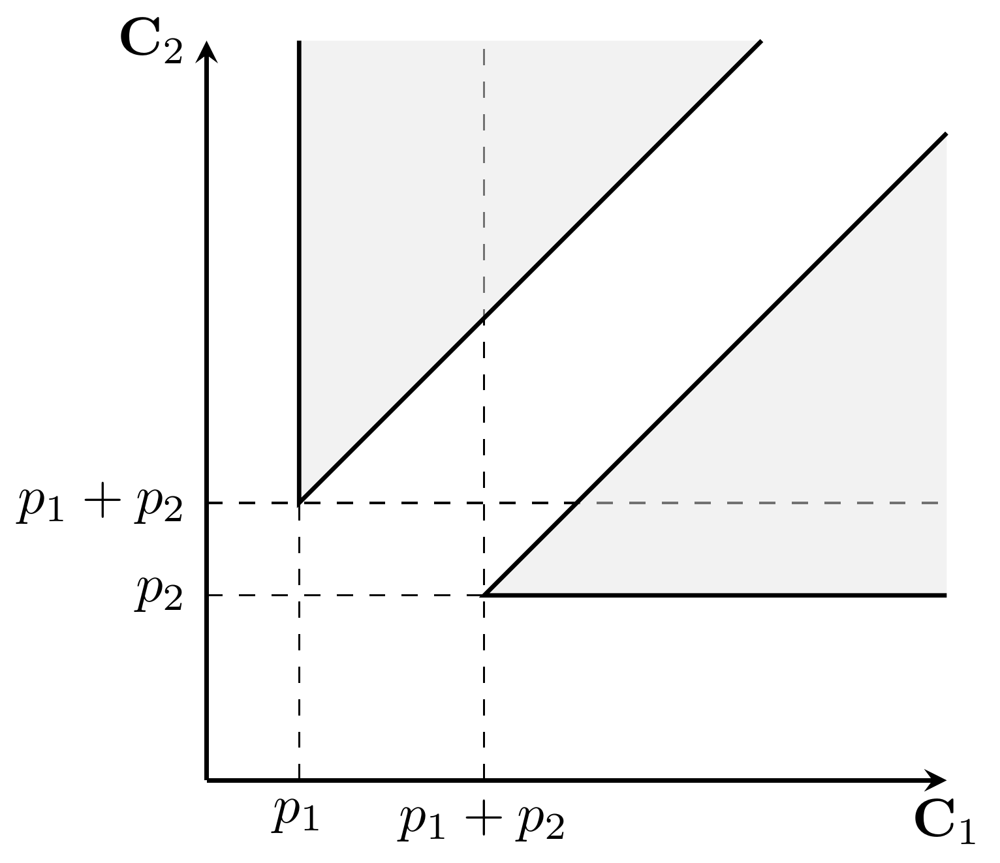

---
tags:
  - mip
  - scheduling
  - branch-and-cut
  - big-m formulation
---

# Single Machine Scheduling (MIP)

We consider [single machine scheduling problems](../intro/scheduling.md) and propose a basic MIP formulation that can be extended for different scenarios.
We introduce a class of valid inequalities for the formulation and apply a [**branch-and-cut**](../mip/mip.md#branch-and-cut) solution procedure.

## Problem description

A set $\mathcal{J} = \{1,\ldots,n\}$ of *jobs* must be processed on a single *machine* without preemption.
The *processing time* of job $j$ is denoted by $p_j$.

## The polyhedron of the feasible schedules

Notice that a solution (i.e., a schedule) can be described solely by specifying the job completion times.
For that, let the continous variable $\mathbf{C}_j$ indicate the completion time of job $j$.
Note that then the start of job $j$ is $\mathbf{C}_j - p_j$.

Two conditions are required for feasibility: no job can start earlier than 0, and jobs must not overlap.
Thus, the set of *feasible solutions* is:

$$
Q = \left\{
  \mathbf{C} \in \mathbb{R}_{0\leq}^n : 
  \begin{aligned}
    & 0 \leq \mathbf{C}_j - p_j && \text{for all}\ 1\leq j\leq n\\
    & \mathbf{C}_j \leq \mathbf{C}_k - p_k \ \text{or} \ \mathbf{C}_k \leq \mathbf{C}_j - p_j && \text{for all}\ 1\leq j < k \leq n
  \end{aligned}
\right\}
$$

For $n=2$, we can depict the set of feasible solutions (the shaded area):

{ width=400 }

Note that the feasible region is not connected due to the *disjunctive no-overlap constraints*.
Fortunately, we can optimize over the convex hull.
Also note that the feasible region is unbounded, thus, maximizing an objective function $\sum_{j}w_j\mathbf{C}_j$ with non-negative $w_j$ coefficients is not a good idea.

## MIP formulation

We use big-M constraints to linearize the disjunctive constraints.

### Variables

Let the continuous variable $\mathbf{C}_j$ denote the completion time of job $j$, and let the binary variable $\mathbf{y}_{jk}$ ($1\leq j < k\leq n$) indicate whether job $j$ precedes job $k$.
Note that using the variables $\mathbf{y}_{jk}$ for $j>k$ is insufficient as $\mathbf{y}_{kj} = 1 - \mathbf{y}_{jk}$ holds.

### Constraints

No job can start earlier than 0:

$$
0 \leq \mathbf{C}_j - p_j \quad\ \text{for all}\ 1 \leq j \leq n
$$

The jobs cannot overlap:

$$
\begin{align*}
    \mathbf{C}_j &\leq \mathbf{C}_k - p_k + \operatorname{M}(1-\mathbf{y}_{jk}) & \text{for all}\ 1\leq j < k\leq n\\
    \mathbf{C}_k &\leq \mathbf{C}_j - p_j + \operatorname{M}\mathbf{y}_{jk}     & \text{for all}\ 1\leq j < k\leq n
\end{align*}
$$

where $\operatorname{M}$ is an appropriately big constant (e.g., the sum of processing times).

## Branch-and-cut

First, we give a complete description of the scheduling polyhedron, then we use those inequalities in a branch-and-cut scheme.

### Valid inequalities

!!! quote "Structure of a simple scheduling polyhedron"
    Queyranne, M. (1993).
    *Structure of a simple scheduling polyhedron*.
    Mathematical Programming, 58(1), 263-285.

The convex hull $\operatorname{conv}(Q)$ of the set of feasible schedules has exactly $2^n-1$ facets defined by the following *parallel inequalities*:

$$
  \frac{1}{2} \left( \sum_{j\in S} p_j^2 + \left( \sum_{j\in S} p_j \right)^2 \right) \leq \sum_{j\in S} p_j\mathbf{C}_j \quad\ \text{for all}\ \emptyset \neq S \subseteq \mathcal{J}
$$

or shortly: $\frac{1}{2}(p^2(S) + p(S)^2) \leq p\mathbf{C}(S)$.
Note that the validity of these inequalities can be easily proven by induction.

Let us back to the example ($n=2$).
For $S= \{1\}$ and $S= \{2\}$, the inequalities are $p_1 \leq \mathbf{C}_1$ and $p_2 \leq \mathbf{C}_2$, respectively.
For $S= \{1,2\}$, the inequality is $p_1^2 + p_1p_2 + p_2^2 \leq p_1\mathbf{C}_1 + p_2\mathbf{C}_2$, cf. the equation of the line passing through the points $(p_1,p_1+p_2)$ and $(p_1+p_2,p_2)$.

The parallel inequalities can be generalized for several extensions of the basic problem (e.g., precedence constraints, release dates, parallel machines).

!!! quote "Polyhedral approaches to machine scheduling"
    Queyranne, M., & Schulz, A. S. (1994).
    *Polyhedral approaches to machine scheduling*.
    Berlin: TU, Fachbereich 3.

### Separation

Of course, adding all the exponentially many submodular inequalities to the problem is not effective.
However, we can separate them dynamically during the global search.

Let $(\bar{C},\bar{y})$ denote the solution of the LP-relaxation of the current branch-and-bound node.
We aim to find the most violated inequality, that is, we want to maximize $\Gamma(S) = g(S) - p\bar{C}(S)$, where $g(S) = \frac{1}{2} ( p^2(S) + p(S)^2 )$.

!!! note "Submodular minimization"
    Note that $g$ is (strictly) supermodular, that is, $g(S \cup T) + g(S \cap T) \geq g(S) + g(T)$ holds for all subsets $S$ and $T$ of the jobs.
    Consequently, $\Gamma$ is also supermodular, thus the separation problem is equivalent to a submodular minimization problem, which can be solved in polynomial time.

The following observation induces an efficient separation procedure.
If $S\subseteq \mathcal{J}$ maximizes $\Gamma$, then $k\in S$ if and only if $\bar{C}_k \leq p(S)$.
Therefore, if $k\in S$, then $j\in S$ for every job $j$ such that $\bar{C}_j \leq \bar{C}_k$.

1. Sort the set of jobs in non-decreasing order of their completion times: $\bar{C}_{\pi(1)} \leq \ldots \leq \bar{C}_{\pi(n)}$.

2. Initalization:

    - the best subset: $S\gets \emptyset$
    - $\Gamma(S)$: $\gamma \gets 0$
    - current subset: $S'\gets \emptyset$ 
    - $\Gamma(S')$: $\gamma' \gets 0$
    - $p(S')$: $\rho \gets 0$

3. For $i=1,\ldots,n$:

    - $S'\gets S' \cup \{\pi(i)\}$
    - $\rho \gets \rho' + p_{\pi(i)}$
    - $\gamma' \gets \gamma' + p_{\pi(i)}(\rho - \bar{C}_{\pi(i)})$
    - if $\gamma' > \gamma$, then $\gamma \gets \gamma'$ and $S \gets S'$

## Implementation

The implementation can be found in <a href="https://github.com/hmarko89/mathoptintro/blob/master/src/singlemachine.py" target="_blank">`singlemachine.py`</a>
